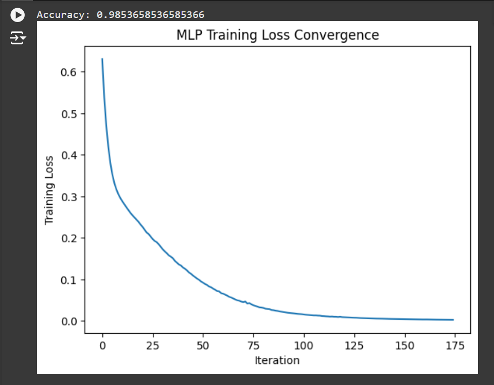
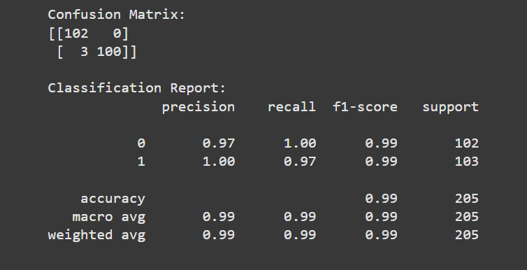

<H3>PRAVIN KUMAR A.</H3>
<H3>212223230155</H3>
<H3>EX. NO.6</H3>
<H3>DATE:7.11.24</H3>
<H1 ALIGN =CENTER>Heart attack prediction using MLP</H1>
<H3>Aim:</H3>  To construct a  Multi-Layer Perceptron to predict heart attack using Python
<H3>Algorithm:</H3>
Step 1:Import the required libraries: numpy, pandas, MLPClassifier, train_test_split, StandardScaler, accuracy_score, and matplotlib.pyplot. 
Step 2:Load the heart disease dataset from a file using pd.read_csv(). 
Step 3:Separate the features and labels from the dataset using data.iloc values for features (X) and data.iloc[:, -1].values for labels (y). 
Step 4:Split the dataset into training and testing sets using train_test_split(). 
Step 5:Normalize the feature data using StandardScaler() to scale the features to have zero mean and unit variance. 
Step 6:Create an MLPClassifier model with desired architecture and hyperparameters, such as hidden_layer_sizes, max_iter, and random_state. 
Step 7:Train the MLP model on the training data using mlp.fit(X_train, y_train). The model adjusts its weights and biases iteratively to minimize the training loss. 
Step 8:Make predictions on the testing set using mlp.predict(X_test). 
Step 9:Evaluate the model's accuracy by comparing the predicted labels (y_pred) with the actual labels (y_test) using accuracy_score(). 
Step 10:Print the accuracy of the model. 
Step 11:Plot the error convergence during training using plt.plot() and plt.show(). 
<H3>Program: </H3>

~~~py
import numpy as np
import pandas as pd
from sklearn.neural_network import MLPClassifier
from sklearn.model_selection import train_test_split
from sklearn.preprocessing import StandardScaler
from sklearn.metrics import accuracy_score,classification_report,confusion_matrix
import matplotlib.pyplot as plt

data = pd.read_csv('heart.csv')

X = data.iloc[:, :-1].values  # Features
y = data.iloc[:, -1].values   # Labels

X_train, X_test, y_train, y_test = train_test_split(X, y, test_size=0.2, random_state=42)

scaler = StandardScaler()
X_train = scaler.fit_transform(X_train)
X_test = scaler.transform(X_test)

mlp = MLPClassifier(hidden_layer_sizes=(100, 100), max_iter=1000, random_state=42)
training_loss = mlp.fit(X_train, y_train).loss_curve_

y_pred = mlp.predict(X_test)

accuracy = accuracy_score(y_test, y_pred)
print("Accuracy:", accuracy)

plt.plot(training_loss)
plt.title("MLP Training Loss Convergence")
plt.xlabel("Iteration")
plt.ylabel("Training Loss")
plt.show()

conf_matrix=confusion_matrix(y_test,y_pred)
classification_rep=classification_report(y_test,y_pred)
print("\nConfusion Matrix:")
print(conf_matrix)
print("\nClassification Report:")
print(classification_rep)
~~~

<H3>Output:</H3>

 

<H3>Results:</H3>
Thus, an ANN with MLP is constructed and trained to predict the heart attack using python.
